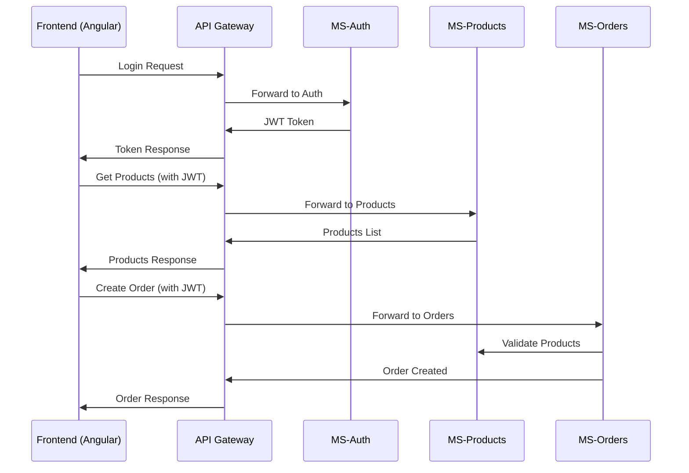

# 📊 Diagrama de Clases - LuchoExpress E-commerce

## 📋 Índice

1. [Introducción](#introducción)
2. [Arquitectura General](#arquitectura-general)
3. [Diagrama de Clases Completo](#diagrama-de-clases-completo)
4. [Microservicios y sus Clases](#microservicios-y-sus-clases)
5. [Frontend - Clases Angular](#frontend---clases-angular)
6. [Relaciones Entre Clases](#relaciones-entre-clases)
7. [Patrones de Diseño Implementados](#patrones-de-diseño-implementados)

---

## 📖 Introducción

Este documento presenta el **diagrama de clases completo** del proyecto **LuchoExpress**, un sistema de e-commerce desarrollado con arquitectura de microservicios. El sistema está construido con **Spring Boot** para el backend y **Angular** para el frontend, implementando patrones como Domain-Driven Design (DDD), Repository Pattern y Clean Architecture.

## 🏗️ Arquitectura General

El proyecto está organizado en los siguientes microservicios:

- **API Gateway** (Puerto 8080) - Enrutamiento y CORS
- **MS-Auth** (Puerto 8081) - Autenticación y autorización
- **MS-Customer** (Puerto 8082) - Gestión de clientes
- **MS-Products** (Puerto 8085) - Gestión de productos y categorías
- **MS-Orders** (Puerto 8084) - Gestión de pedidos
- **MS-Tracking** (Puerto 8086) - Seguimiento de pedidos
- **Frontend Angular** (Puerto 4200) - Interfaz de usuario

---

## 📊 Diagrama de Clases Completo

```mermaid
classDiagram
    %% ================================
    %% MICROSERVICIO DE AUTENTICACIÓN
    %% ================================
    
    class User {
        +UUID id
        +String username
        +String passwordHash
        +String email
        +RoleEnum role
        +boolean enabled
        +LocalDateTime createdAt
        +User(username, passwordHash, email, role)
        +void setPasswordHash(String)
        +boolean isEnabled()
    }
    
    class RoleEnum {
        <<enumeration>>
        ROOT
        ADMIN
        USER
    }
    
    class LoginRequest {
        +String username
        +String password
    }
    
    class RegisterRequest {
        +String username
        +String password
        +String email
        +RoleEnum role
    }
    
    class TokenResponse {
        +String token
        +String type
        +LocalDateTime expiresAt
    }
    
    class UserResponse {
        +UUID id
        +String username
        +String email
        +RoleEnum role
        +boolean enabled
        +LocalDateTime createdAt
    }
    
    class AuthController {
        -UserService userService
        -JwtService jwtService
        +ResponseEntity<TokenResponse> login(LoginRequest)
        +ResponseEntity<UserResponse> register(RegisterRequest)
        +ResponseEntity<UserResponse> getCurrentUser()
    }
    
    class UserService {
        -UserRepository userRepository
        -PasswordEncoder passwordEncoder
        +User createUser(CreateUserRequest)
        +User findByUsername(String)
        +List<User> findAll()
        +User updateUser(UUID, UpdateUserRequest)
        +void deleteUser(UUID)
    }
    
    class JwtService {
        -String secretKey
        -long jwtExpiration
        +String extractUsername(String)
        +Date extractExpiration(String)
        +String generateToken(UserDetails)
        +Boolean validateToken(String, UserDetails)
    }
    
    class UserRepository {
        <<interface>>
        +Optional<User> findByUsername(String)
        +Optional<User> findByEmail(String)
        +List<User> findByRole(RoleEnum)
        +boolean existsByUsername(String)
        +boolean existsByEmail(String)
    }
    
    %% ================================
    %% MICROSERVICIO DE CLIENTES
    %% ================================
    
    class Customer {
        +UUID id
        +UUID userId
        +String documentId
        +String name
        +String email
        +String phone
        +String address
        +boolean enabled
        +LocalDateTime createdAt
        +LocalDateTime updatedAt
        +Customer(userId, documentId, name, email, phone, address)
    }
    
    class CreateCustomerRequest {
        +UUID userId
        +String documentId
        +String name
        +String email
        +String phone
        +String address
    }
    
    class UpdateCustomerRequest {
        +String name
        +String email
        +String phone
        +String address
    }
    
    class CustomerResponse {
        +UUID id
        +UUID userId
        +String documentId
        +String name
        +String email
        +String phone
        +String address
        +boolean enabled
        +LocalDateTime createdAt
        +LocalDateTime updatedAt
    }
    
    class CustomerController {
        -CustomerService customerService
        +ResponseEntity<CustomerResponse> createCustomer(CreateCustomerRequest)
        +ResponseEntity<CustomerResponse> getCustomer(UUID)
        +ResponseEntity<CustomerResponse> updateCustomer(UUID, UpdateCustomerRequest)
        +ResponseEntity<Void> deleteCustomer(UUID)
        +ResponseEntity<List<CustomerResponse>> getAllCustomers()
    }
    
    class CustomerService {
        -CustomerRepository customerRepository
        +Customer createCustomer(CreateCustomerRequest)
        +Customer findById(UUID)
        +Customer findByUserId(UUID)
        +Customer updateCustomer(UUID, UpdateCustomerRequest)
        +void deleteCustomer(UUID)
        +List<Customer> findAll()
    }
    
    class CustomerRepository {
        <<interface>>
        +Optional<Customer> findByUserId(UUID)
        +Optional<Customer> findByDocumentId(String)
        +boolean existsByDocumentId(String)
        +boolean existsByEmail(String)
    }
    
    %% ================================
    %% MICROSERVICIO DE PRODUCTOS
    %% ================================
    
    class Product {
        +UUID id
        +UUID categoryId
        +String name
        +String imageUrl
        +String description
        +BigDecimal price
        +LocalDateTime createdAt
        +LocalDateTime updatedAt
        +Category category
        +Product(categoryId, name, imageUrl, description, price)
    }
    
    class Category {
        +UUID id
        +String name
        +String description
        +LocalDateTime createdAt
        +LocalDateTime updatedAt
        +Category(name, description)
    }
    
    class ProductResponse {
        +UUID id
        +UUID categoryId
        +String name
        +String imageUrl
        +String description
        +BigDecimal price
        +LocalDateTime createdAt
        +LocalDateTime updatedAt
        +CategoryResponse category
    }
    
    class CategoryResponse {
        +UUID id
        +String name
        +String description
        +LocalDateTime createdAt
        +LocalDateTime updatedAt
    }
    
    class CreateProductRequest {
        +UUID categoryId
        +String name
        +String imageUrl
        +String description
        +BigDecimal price
    }
    
    class UpdateProductRequest {
        +String name
        +String imageUrl
        +String description
        +BigDecimal price
    }
    
    class ProductController {
        -ProductService productService
        +ResponseEntity<List<ProductResponse>> getAllProducts()
        +ResponseEntity<ProductResponse> getProduct(UUID)
        +ResponseEntity<ProductResponse> createProduct(CreateProductRequest)
        +ResponseEntity<ProductResponse> updateProduct(UUID, UpdateProductRequest)
        +ResponseEntity<Void> deleteProduct(UUID)
        +ResponseEntity<List<ProductResponse>> getProductsByCategory(UUID)
    }
    
    class CategoryController {
        -CategoryService categoryService
        +ResponseEntity<List<CategoryResponse>> getAllCategories()
        +ResponseEntity<CategoryResponse> getCategory(UUID)
        +ResponseEntity<CategoryResponse> createCategory(CreateCategoryRequest)
        +ResponseEntity<CategoryResponse> updateCategory(UUID, UpdateCategoryRequest)
        +ResponseEntity<Void> deleteCategory(UUID)
    }
    
    class ProductService {
        -ProductRepository productRepository
        -CategoryRepository categoryRepository
        +Product createProduct(CreateProductRequest)
        +Product findById(UUID)
        +List<Product> findAll()
        +List<Product> findByCategory(UUID)
        +Product updateProduct(UUID, UpdateProductRequest)
        +void deleteProduct(UUID)
    }
    
    class CategoryService {
        -CategoryRepository categoryRepository
        +Category createCategory(CreateCategoryRequest)
        +Category findById(UUID)
        +List<Category> findAll()
        +Category updateCategory(UUID, UpdateCategoryRequest)
        +void deleteCategory(UUID)
    }
    
    class ProductRepository {
        <<interface>>
        +List<Product> findByCategoryId(UUID)
        +List<Product> findByNameContainingIgnoreCase(String)
        +List<Product> findByPriceBetween(BigDecimal, BigDecimal)
    }
    
    class CategoryRepository {
        <<interface>>
        +Optional<Category> findByName(String)
        +boolean existsByName(String)
    }
    
    %% ================================
    %% MICROSERVICIO DE PEDIDOS
    %% ================================
    
    class Order {
        +UUID id
        +String orderNumber
        +UUID customerId
        +List<OrderProduct> products
        +String deliveryAddress
        +OrderStatusEnum status
        +LocalDate orderDate
        +LocalDate estimatedDeliveryDate
        +BigDecimal totalAmount
        +LocalDateTime createdAt
        +LocalDateTime updatedAt
        +Order(customerId, deliveryAddress, estimatedDeliveryDate)
        +void addProduct(OrderProduct)
        +void calculateTotalAmount()
        +String generateOrderNumber()
    }
    
    class OrderProduct {
        +UUID id
        +Order order
        +UUID productId
        +int quantity
        +String productName
        +BigDecimal unitPrice
        +OrderProduct(productId, quantity, productName, unitPrice)
        +BigDecimal getSubtotal()
    }
    
    class OrderStatusEnum {
        <<enumeration>>
        PENDING
        SHIPPED
        DELIVERED
        CANCELLED
    }
    
    class CreateOrderRequest {
        +UUID customerId
        +List<CreateOrderProductRequest> products
        +String deliveryAddress
        +LocalDate estimatedDeliveryDate
    }
    
    class CreateOrderProductRequest {
        +UUID productId
        +int quantity
    }
    
    class UpdateOrderRequest {
        +OrderStatusEnum status
        +String deliveryAddress
        +LocalDate estimatedDeliveryDate
    }
    
    class OrderResponse {
        +UUID id
        +String orderNumber
        +UUID customerId
        +List<OrderProductResponse> products
        +String deliveryAddress
        +OrderStatusEnum status
        +LocalDate orderDate
        +LocalDate estimatedDeliveryDate
        +BigDecimal totalAmount
        +LocalDateTime createdAt
        +LocalDateTime updatedAt
    }
    
    class OrderProductResponse {
        +UUID id
        +UUID productId
        +int quantity
        +String productName
        +BigDecimal unitPrice
        +BigDecimal subtotal
    }
    
    class OrderController {
        -OrderService orderService
        +ResponseEntity<OrderResponse> createOrder(CreateOrderRequest)
        +ResponseEntity<OrderResponse> getOrder(UUID)
        +ResponseEntity<List<OrderResponse>> getOrdersByCustomer(UUID)
        +ResponseEntity<OrderResponse> updateOrder(UUID, UpdateOrderRequest)
        +ResponseEntity<Void> deleteOrder(UUID)
        +ResponseEntity<List<OrderResponse>> getAllOrders()
    }
    
    class OrderService {
        -OrderRepository orderRepository
        -OrderProductRepository orderProductRepository
        -CustomerServiceClient customerServiceClient
        -ProductServiceClient productServiceClient
        -TrackingServiceClient trackingServiceClient
        +Order createOrder(CreateOrderRequest)
        +Order findById(UUID)
        +List<Order> findByCustomerId(UUID)
        +Order updateOrder(UUID, UpdateOrderRequest)
        +void deleteOrder(UUID)
        +List<Order> findAll()
    }
    
    class OrderRepository {
        <<interface>>
        +List<Order> findByCustomerId(UUID)
        +List<Order> findByStatus(OrderStatusEnum)
        +Optional<Order> findByOrderNumber(String)
    }
    
    class OrderProductRepository {
        <<interface>>
        +List<OrderProduct> findByOrderId(UUID)
        +List<OrderProduct> findByProductId(UUID)
    }
    
    %% ================================
    %% MICROSERVICIO DE TRACKING
    %% ================================
    
    class TrackingStatus {
        +UUID orderId
        +String orderNumber
        +UUID userId
        +OrderStatusEnum status
        +LocalDateTime updatedAt
    }
    
    class TrackingController {
        -TrackingService trackingService
        +ResponseEntity<List<TrackingStatus>> getTrackingByUser(UUID)
        +ResponseEntity<TrackingStatus> getTrackingByOrder(UUID)
        +ResponseEntity<TrackingStatus> updateOrderStatus(UUID, OrderStatusEnum)
    }
    
    class TrackingService {
        -RedisTemplate redisTemplate
        -OrderServiceClient orderServiceClient
        -CustomerServiceClient customerServiceClient
        +TrackingStatus getTrackingByOrderId(UUID)
        +List<TrackingStatus> getTrackingByUserId(UUID)
        +TrackingStatus updateOrderStatus(UUID, OrderStatusEnum)
    }
    
    %% ================================
    %% FRONTEND ANGULAR - SERVICIOS
    %% ================================
    
    class AuthService {
        -HttpClient http
        -BehaviorSubject<boolean> isAuthenticated
        +Observable<TokenResponse> login(username, password)
        +Observable<UserResponse> register(registerData)
        +void logout()
        +boolean isLoggedIn()
        +String getToken()
        +Observable<UserResponse> getCurrentUser()
    }
    
    class CustomerService {
        -HttpClient http
        -AuthService authService
        +Observable<CustomerResponse> createCustomer(CreateCustomerRequest)
        +Observable<CustomerResponse> getCustomer(UUID)
        +Observable<CustomerResponse> updateCustomer(UUID, UpdateCustomerRequest)
        +Observable<void> deleteCustomer(UUID)
        +Observable<CustomerExistsResponse> checkCustomerExists(UUID)
    }
    
    class ProductsService {
        -HttpClient http
        +Observable<ProductResponse[]> getProducts()
        +Observable<ProductResponse> getProduct(UUID)
        +Observable<CategoryResponse[]> getCategories()
        +Observable<ProductResponse[]> getProductsByCategory(UUID)
    }
    
    class OrderService {
        -HttpClient http
        -AuthService authService
        +Observable<OrderResponse> createOrder(CreateOrderRequest)
        +Observable<OrderResponse> getOrder(UUID)
        +Observable<OrderResponse[]> getOrdersByCustomer(UUID)
        +Observable<OrderResponse[]> getAllOrders()
        +Observable<OrderResponse> updateOrder(UUID, UpdateOrderRequest)
    }
    
    class CartService {
        -BehaviorSubject<CartItem[]> cartItems
        -BehaviorSubject<number> cartTotal
        +void addToCart(CartItem)
        +void removeFromCart(UUID)
        +void updateQuantity(UUID, number)
        +void clearCart()
        +Observable<CartItem[]> getCartItems()
        +Observable<number> getCartTotal()
        +number getCartItemCount()
    }
    
    class TrackingService {
        -HttpClient http
        +Observable<TrackingStatus[]> getTrackingByUser(UUID)
        +Observable<TrackingStatus> getTrackingByOrder(UUID)
    }
    
    %% ================================
    %% FRONTEND ANGULAR - COMPONENTES
    %% ================================
    
    class AppComponent {
        +title: string
        +isAuthenticated: boolean
        -AuthService authService
        -CustomerService customerService
        +ngOnInit(): void
        +logout(): void
        +checkCustomerProfile(): void
    }
    
    class LoginComponent {
        +loginForm: FormGroup
        +loading: boolean
        +error: string
        -AuthService authService
        -Router router
        +onSubmit(): void
        +navigateToRegister(): void
    }
    
    class HomeComponent {
        +categories: CategoryResponse[]
        +featuredProducts: ProductResponse[]
        +loading: boolean
        -ProductsService productsService
        -CartService cartService
        +ngOnInit(): void
        +addToCart(product: ProductResponse): void
    }
    
    class ProductsComponent {
        +products: ProductResponse[]
        +categories: CategoryResponse[]
        +selectedCategory: UUID
        +loading: boolean
        -ProductsService productsService
        -CartService cartService
        +ngOnInit(): void
        +filterByCategory(categoryId: UUID): void
        +addToCart(product: ProductResponse): void
    }
    
    class CheckoutComponent {
        +cartItems: CartItem[]
        +checkoutForm: FormGroup
        +totalAmount: number
        +loading: boolean
        -CartService cartService
        -OrderService orderService
        -CustomerService customerService
        +ngOnInit(): void
        +onSubmit(): void
        +validateMinimumOrder(): boolean
        +formatCurrency(amount: number): string
    }
    
    class OrdersComponent {
        +orders: OrderResponse[]
        +loading: boolean
        +selectedOrder: OrderResponse
        -OrderService orderService
        -AuthService authService
        +ngOnInit(): void
        +viewOrderDetails(order: OrderResponse): void
        +cancelOrder(orderId: UUID): void
    }
    
    class AdminUsersComponent {
        +users: UserResponse[]
        +loading: boolean
        +userForm: FormGroup
        -UserService userService
        +ngOnInit(): void
        +createUser(): void
        +updateUser(user: UserResponse): void
        +deleteUser(userId: UUID): void
    }
    
    class AdminProductsComponent {
        +products: ProductResponse[]
        +categories: CategoryResponse[]
        +productForm: FormGroup
        +loading: boolean
        -ProductManagementService productService
        +ngOnInit(): void
        +createProduct(): void
        +updateProduct(product: ProductResponse): void
        +deleteProduct(productId: UUID): void
    }
    
    class AdminOrdersComponent {
        +orders: OrderResponse[]
        +statusOptions: OrderStatusEnum[]
        +loading: boolean
        -OrderService orderService
        +ngOnInit(): void
        +updateOrderStatus(orderId: UUID, status: OrderStatusEnum): void
        +viewOrderDetails(order: OrderResponse): void
    }
    
    %% ================================
    %% MODELOS DE INTERFAZ (FRONTEND)
    %% ================================
    
    class CartItem {
        +UUID id
        +String name
        +BigDecimal price
        +int quantity
        +String imageUrl
        +BigDecimal subtotal
    }
    
    %% ================================
    %% INTERCEPTORES Y GUARDIAS
    %% ================================
    
    class AuthInterceptor {
        -AuthService authService
        +intercept(request: HttpRequest, next: HttpHandler): Observable<HttpEvent>
    }
    
    class AuthGuard {
        -AuthService authService
        -Router router
        +canActivate(): boolean
        +canActivateChild(): boolean
    }
    
    %% ================================
    %% RELACIONES
    %% ================================
    
    %% Dominio - Enums
    User ||--|| RoleEnum : has
    Order ||--|| OrderStatusEnum : has
    TrackingStatus ||--|| OrderStatusEnum : has
    
    %% Dominio - Relaciones de Entidades
    Product }|--|| Category : belongs_to
    Order ||--o{ OrderProduct : contains
    User ||--o| Customer : profile
    
    %% Controllers - Services
    AuthController --> UserService
    AuthController --> JwtService
    CustomerController --> CustomerService
    ProductController --> ProductService
    CategoryController --> CategoryService
    OrderController --> OrderService
    TrackingController --> TrackingService
    
    %% Services - Repositories
    UserService --> UserRepository
    CustomerService --> CustomerRepository
    ProductService --> ProductRepository
    CategoryService --> CategoryRepository
    OrderService --> OrderRepository
    OrderService --> OrderProductRepository
    
    %% DTOs - Entities
    UserResponse --|> User
    CustomerResponse --|> Customer
    ProductResponse --|> Product
    CategoryResponse --|> Category
    OrderResponse --|> Order
    OrderProductResponse --|> OrderProduct
    
    %% Frontend Services - Backend APIs
    AuthService ..> AuthController : HTTP
    CustomerService ..> CustomerController : HTTP
    ProductsService ..> ProductController : HTTP
    ProductsService ..> CategoryController : HTTP
    OrderService ..> OrderController : HTTP
    TrackingService ..> TrackingController : HTTP
    
    %% Frontend Components - Services
    AppComponent --> AuthService
    AppComponent --> CustomerService
    LoginComponent --> AuthService
    HomeComponent --> ProductsService
    HomeComponent --> CartService
    ProductsComponent --> ProductsService
    ProductsComponent --> CartService
    CheckoutComponent --> CartService
    CheckoutComponent --> OrderService
    CheckoutComponent --> CustomerService
    OrdersComponent --> OrderService
    OrdersComponent --> AuthService
    AdminUsersComponent --> UserService
    AdminProductsComponent --> ProductManagementService
    AdminOrdersComponent --> OrderService
    
    %% Interceptors
    AuthInterceptor --> AuthService
    
    %% Client Services (Microservice Communication)
    OrderService --> CustomerServiceClient : calls
    OrderService --> ProductServiceClient : calls
    OrderService --> TrackingServiceClient : calls
    TrackingService --> OrderServiceClient : calls
    TrackingService --> CustomerServiceClient : calls
```

---

## 🔧 Microservicios y sus Clases

### 🔐 MS-Auth (Puerto 8081)

**Dominio:**
- `User` - Entidad principal con datos de autenticación
- `RoleEnum` - Roles del sistema (ROOT, ADMIN, USER)

**Aplicación:**
- `AuthController` - Endpoints de login/registro
- `UserService` - Lógica de negocio de usuarios
- `JwtService` - Generación y validación de tokens

**DTOs:**
- `LoginRequest`, `RegisterRequest`, `TokenResponse`, `UserResponse`

**Infraestructura:**
- `UserRepository` - Persistencia JPA

---

### 👤 MS-Customer (Puerto 8082)

**Dominio:**
- `Customer` - Perfil del cliente con datos personales

**Aplicación:**
- `CustomerController` - CRUD de clientes
- `CustomerService` - Lógica de negocio

**DTOs:**
- `CreateCustomerRequest`, `UpdateCustomerRequest`, `CustomerResponse`

**Infraestructura:**
- `CustomerRepository` - Persistencia JPA

---

### 🛍️ MS-Products (Puerto 8085)

**Dominio:**
- `Product` - Entidad producto con precios y descripción
- `Category` - Categorías de productos

**Aplicación:**
- `ProductController`, `CategoryController` - APIs REST
- `ProductService`, `CategoryService` - Lógica de negocio

**DTOs:**
- `ProductResponse`, `CategoryResponse`, `CreateProductRequest`, etc.

**Infraestructura:**
- `ProductRepository`, `CategoryRepository` - Persistencia JPA

---

### 📦 MS-Orders (Puerto 8084)

**Dominio:**
- `Order` - Pedido con productos y estado
- `OrderProduct` - Detalle de productos en el pedido
- `OrderStatusEnum` - Estados del pedido

**Aplicación:**
- `OrderController` - API de pedidos
- `OrderService` - Lógica compleja de pedidos

**DTOs:**
- `CreateOrderRequest`, `OrderResponse`, `OrderProductResponse`

**Infraestructura:**
- `OrderRepository`, `OrderProductRepository` - Persistencia JPA
- Clientes para comunicación inter-microservicios

---

### 📍 MS-Tracking (Puerto 8086)

**Dominio:**
- `TrackingStatus` - Estado de seguimiento del pedido

**Aplicación:**
- `TrackingController` - API de seguimiento
- `TrackingService` - Gestión con Redis

**Infraestructura:**
- Redis para cache de estados
- Clientes para comunicación con otros servicios

---

## 🎨 Frontend - Clases Angular

### 📋 Servicios

- **`AuthService`** - Autenticación y manejo de tokens
- **`CustomerService`** - Gestión de perfiles de cliente
- **`ProductsService`** - Consulta de productos y categorías
- **`OrderService`** - Creación y consulta de pedidos
- **`CartService`** - Carrito de compras con BehaviorSubject
- **`TrackingService`** - Seguimiento de pedidos

### 🖥️ Componentes

- **`AppComponent`** - Componente raíz con navegación
- **`LoginComponent`** - Formulario de autenticación
- **`HomeComponent`** - Página principal con productos destacados
- **`ProductsComponent`** - Catálogo de productos
- **`CheckoutComponent`** - Proceso de compra
- **`OrdersComponent`** - Historia de pedidos
- **Admin Components** - Panel administrativo

### 🛡️ Interceptores y Guardias

- **`AuthInterceptor`** - Inyección automática de tokens JWT
- **`AuthGuard`** - Protección de rutas privadas

---

## 🔗 Relaciones Entre Clases

### 🏛️ Relaciones de Dominio

1. **User ↔ Customer (1:1)**: Un usuario tiene un perfil de cliente
2. **Category ↔ Product (1:N)**: Una categoría tiene múltiples productos
3. **Order ↔ OrderProduct (1:N)**: Un pedido contiene múltiples productos
4. **User/Customer ↔ Order (1:N)**: Un cliente puede tener múltiples pedidos

### 🌐 Comunicación Inter-Microservicios

```mermaid
graph TB
    Gateway[API Gateway :8080] --> Auth[MS-Auth :8081]
    Gateway --> Customer[MS-Customer :8082]
    Gateway --> Products[MS-Products :8085]
    Gateway --> Orders[MS-Orders :8084]
    Gateway --> Tracking[MS-Tracking :8086]
    
    Orders -.-> Customer : HTTP Client
    Orders -.-> Products : HTTP Client
    Orders -.-> Tracking : HTTP Client
    Tracking -.-> Orders : HTTP Client
    Tracking -.-> Customer : HTTP Client
    
    Frontend[Angular :4200] --> Gateway
```

### 📱 Flujo Frontend ↔ Backend



---

## 🎯 Patrones de Diseño Implementados

### 🏗️ Domain-Driven Design (DDD)
- **Entidades**: `User`, `Customer`, `Product`, `Order`
- **Value Objects**: `RoleEnum`, `OrderStatusEnum`
- **Agregados**: `Order` con `OrderProduct`

### 🗄️ Repository Pattern
- Interfaces de repositorio para cada entidad
- Implementación JPA automática
- Separación entre dominio y persistencia

### 🧅 Clean Architecture
- **Dominio**: Entidades y reglas de negocio
- **Aplicación**: Servicios y casos de uso
- **Infraestructura**: Repositorios, APIs, clientes HTTP

### 📡 API Gateway Pattern
- Punto único de entrada
- Enrutamiento por microservicio
- Configuración CORS centralizada

### 🔐 JWT Token Pattern
- Autenticación stateless
- Tokens con expiración
- Interceptor automático en frontend

### 🛒 Observer Pattern (Frontend)
- `BehaviorSubject` para estado del carrito
- Observables para comunicación de componentes
- Reactive programming con RxJS

### 🏭 Factory Pattern
- Creación de entidades con constructores específicos
- DTOs como factory para responses

### 📦 Facade Pattern
- Servicios como fachadas para la lógica compleja
- Controllers como fachadas para las APIs

---

## 🚀 Uso del Diagrama

Este diagrama es útil para:

1. **Desarrolladores nuevos** - Entender la arquitectura completa
2. **Mantenimiento** - Localizar clases y dependencias
3. **Extensiones** - Identificar dónde agregar nuevas funcionalidades
4. **Documentación** - Referencia técnica del sistema
5. **Testing** - Identificar puntos de integración para pruebas

---

## 📚 Tecnologías Utilizadas

- **Backend**: Spring Boot, Spring Security, Spring Cloud Gateway, JWT, JPA/Hibernate
- **Frontend**: Angular, TypeScript, RxJS, PrimeNG
- **Bases de Datos**: PostgreSQL, MySQL, Redis
- **Contenedores**: Docker, Docker Compose
- **Arquitectura**: Microservicios, API Gateway, Clean Architecture

---

**📝 Nota**: Este diagrama representa la arquitectura actual del sistema. Para cambios o actualizaciones, consulte la documentación específica de cada microservicio en sus respectivos directorios README.

---

*Generado para LuchoExpress E-commerce Platform - Diciembre 2024*
