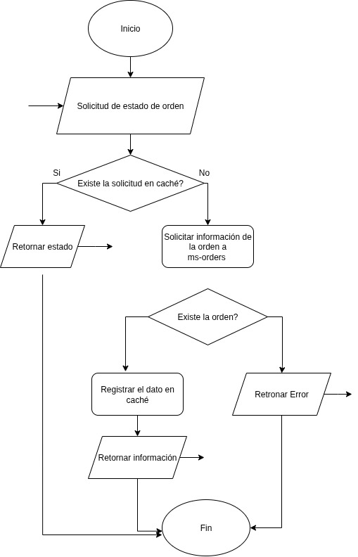

# LuchoExpress 🚀
### A Full-Stack E-commerce Delivery Platform Built with Microservices Architecture

LuchoExpress is a modern, scalable e-commerce delivery platform built using a microservices architecture with Spring Boot backend and Angular frontend. The system provides a complete solution for product management, order processing, user authentication, and real-time order tracking.


## Architecture Overview

LuchoExpress follows a **microservices architecture** pattern, ensuring scalability, maintainability, and independent deployment capabilities. The system is composed of multiple specialized services that communicate through well-defined APIs.

### System Components


**Backend Services:**
- **API Gateway** - Central entry point for all client requests
- **Authentication Service (MS-Auth)** - User management and JWT authentication
- **Customer Service (MS-Customer)** - Customer profile management
- **Product Service (MS-Products)** - Product and category management
- **Order Service (MS-Orders)** - Order processing and management
- **Tracking Service (MS-Tracking)** - Real-time order tracking

**Frontend:**
- **Angular 19 Application** - Modern, responsive web interface


**Databases:**
- **PostgreSQL** - For authentication and customer data
- **MySQL** - For products and orders data
- **Redis** - For tracking data and caching

## 🛠️ Technology Stack

### Backend Technologies
- **Framework:** Spring Boot 3.x
- **Architecture:** Clean Architecture (Domain-Driven Design)
- **Security:** Spring Security with JWT authentication
- **OAuth2:** OAuth2  with JWT tokens
- **API Gateway:** Spring Cloud Gateway
- **Communication:** RESTful APIs, OpenFeign clients
- **Databases:** PostgreSQL, MySQL, Redis
- **Containerization:** Docker & Docker Compose
- **Build Tool:** Maven

### Frontend Technologies
- **Framework:** Angular 19
- **UI Library:** PrimeNG 20
- **Styling:** Tailwind CSS 3.4
- **State Management:** RxJS Observables
- **Authentication:** JWT with HTTP Interceptors
- **Routing:** Angular Router with Guards

## Features

### 🔐 Authentication & Authorization
- **User Registration & Login** with JWT tokens
- **OAuth2** implementation for secure API access
- **Role-based Access Control** (USER, ADMIN, ROOT)
- **JWT Token Validation** with HS512 algorithm
- **Session Management** with automatic token refresh
- **Password Change** functionality
- **Account Status Management** (enable/disable users)

### Product Management
- **Category Management** with hierarchical structure
- **Product Catalog** with detailed information
- **Inventory Management** for administrators
- **Public Product Browsing** for customers
- **Category-based Product Filtering**

### Customer Management
- **Customer Profile Creation** and management
- **Customer Information** storage and retrieval
- **Document ID Validation** to prevent duplicates
- **Customer-User Relationship** mapping

### Shopping Cart System
- **Persistent Cart** with localStorage
- **Real-time Cart Updates** with item count badge
- **Quantity Management** (increase/decrease items)
- **Duplicate Product Handling** (automatic quantity merge)
- **Cart Validation** before checkout

### Order Processing
- **Order Creation** with product validation
- **Order Status Management** (PENDING, CONFIRMED, SHIPPED, DELIVERED, CANCELLED)
- **Order History** for customers
- **Order Management** for administrators
- **Order Number Generation** with unique identifiers


### 📍 Real-time Tracking
- **Order Status Tracking** with Redis caching
- **Real-time Updates** for order progress
- **Tracking History** with timestamps
- **TTL-based Data Management** (1-hour cache expiration)


## Service Details

### 🔑 Authentication Service (MS-Auth)
**Port:** 8081 | **Database:** PostgreSQL

**Features:**
- User registration and login
- JWT token generation and validation with HS512 algorithm
- OAuth2 Authorization Server capabilities
- Role-based authorization (USER, ADMIN, ROOT)
- User management (CRUD operations)
- Password encryption with BCrypt
- Account status management

**Key Endpoints:**
- `POST /auth/register` - User registration
- `POST /auth/token` - User login
- `GET /auth/me` - Get current user
- `GET /auth/users` - List users (Admin only)
- `POST /auth/users` - Create user (Admin only)
- `PATCH /auth/users/{id}` - Update user password

### Customer Service (MS-Customer)
**Port:** 8082 | **Database:** PostgreSQL

**Features:**
- Customer profile management
- Customer-user relationship mapping
- Document ID validation
- Customer search and retrieval

**Key Endpoints:**
- `POST /api/customers` - Create customer
- `GET /api/customers` - List all customers
- `GET /api/customers/{id}` - Get customer by ID
- `GET /api/customers/by-user/{userId}` - Get customer by user ID
- `GET /api/customers/email/{email}` - Get customer by email
- `PUT /api/customers/{id}` - Update customer

### Product Service (MS-Products)
**Port:** 8085 | **Database:** MySQL

**Features:**
- Product catalog management
- Category hierarchy management
- Product-category relationships
- Public product browsing
- Admin product management

**Key Endpoints:**
- `GET /api/products` - List all products (Public)
- `GET /api/products/{id}` - Get product by ID (Public)
- `POST /api/products` - Create product (Admin only)
- `PATCH /api/products/{id}` - Update product (Admin only)
- `GET /api/categories` - List categories (Public)
- `GET /api/categories-with-products` - Categories with products (Public)
- `POST /api/categories` - Create category (Admin only)

### 📦 Order Service (MS-Orders)
**Port:** 8084 | **Database:** MySQL

**Features:**
- Order creation and management
- OAuth2 with JWT validation
- Product validation via Product Service
- Order status workflow
- Customer order history
- Integration with Tracking Service



**Key Endpoints:**
- `POST /api/orders` - Create order (Authenticated users)
- `GET /api/orders/me` - Get my orders (Users)
- `GET /api/orders` - List all orders (Admin only)
- `GET /api/orders/{id}` - Get order by ID
- `GET /api/orders/by-order-number/{orderNumber}` - Get order by number (Public)
- `PUT /api/orders/{id}` - Update order (Admin only)
- `PUT /api/orders/{id}/cancel` - Cancel order

### Tracking Service (MS-Tracking)
**Port:** 8086 | **Database:** Redis

**Features:**
- Real-time order tracking
- Status update notifications
- TTL-based cache management
- Integration with Order Service

**Key Endpoints:**
- `POST /api/tracking` - Create/Update tracking (Internal)
- `GET /api/tracking/{orderId}` - Get tracking by order ID
- `GET /api/tracking/order-number/{orderNumber}` - Get tracking by order number

### API Gateway
**Port:** 8080

**Features:**
- Single entry point for all services
- Request routing and load balancing
- CORS configuration
- Service discovery and health checks

**Route Configuration:**
- `/auth/**` → Authentication Service (8081)
- `/api/customers/**` → Customer Service (8082)
- `/api/orders/**` → Order Service (8084)
- `/api/products/**` → Product Service (8085)
- `/api/categories/**` → Product Service (8085)
- `/api/tracking/**` → Tracking Service (8086)

## Getting Started

### Prerequisites
- **Docker** and **Docker Compose** installed
- **4GB RAM** minimum available
- **Ports Available:** 3306, 3307, 4200, 5432, 5433, 6379, 8080-8086

### Quick Start with Docker Compose

1. **Clone the repository:**
```bash
git clone <repository-url>
cd LuchoExpress
```

2. **Start the entire application:**
```bash
docker-compose up -d
```

3. **Access the application:**
- **Frontend:** http://localhost:4200
- **API Gateway:** http://localhost:8080

4. **Stop the application:**
```bash
docker-compose down
```

### Alternative: Using Docker Hub Images

```bash
# Run containers using pre-built images
./run-local-containers.sh

# Stop all containers
./stop-local-containers.sh
```

## Docker Images

All services are available on Docker Hub under the `luissagx` organization:

- `luissagx/frontend-lucho-express:v2`
- `luissagx/api-gateway-lucho-express:v2`
- `luissagx/ms-auth-lucho-express:v2`
- `luissagx/ms-customer-lucho-express:v2`
- `luissagx/ms-product-lucho-express:v2`
- `luissagx/ms-orders-lucho-express:v2`
- `luissagx/ms-tracking-lucho-express:v2`

## Service Communication

### Inter-Service Communication
- **Synchronous:** RESTful APIs with OpenFeign clients
- **Authentication:** API Key-based for internal communication
- **Service Discovery:** Direct service URLs in containerized environment
- **Error Handling:** Graceful degradation and circuit breaker patterns

### Data Flow Example
1. **User places order** → Frontend calls API Gateway
2. **API Gateway routes** → Order Service
3. **Order Service validates products** → Product Service
4. **Order Service creates order** → MySQL Database
5. **Order Service notifies tracking** → Tracking Service (Redis)
6. **Real-time updates** → Frontend polling/refresh

## Configuration

### Environment Variables
Each service can be configured through environment variables:

- **Database connections** (host, port, credentials)
- **JWT secrets** for token validation
- **API keys** for inter-service communication
- **CORS origins** for frontend access
- **Cache TTL** for tracking data

### Development vs Production
- **Development:** CORS enabled, detailed logging
- **Production:** CORS restricted, optimized configurations
- **Security:** Different JWT secrets and API keys per environment

## 🧪 Testing

### Frontend Testing
```bash
cd frontend
npm install
npm test
```

### Backend Testing
```bash
cd backend/[service-name]
./mvnw test
```

## Monitoring and Health Checks

- **Actuator endpoints** for service health monitoring
- **Database connection** health checks
- **Memory and CPU** usage monitoring
- **Request/Response** logging and tracing

## 🔐 Security Considerations

### OAuth2 & JWT Implementation
- **Authentication Service** acts as OAuth2 Authorization Server
- **Resource Services** (Orders, Products, Tracking) implement OAuth2
- **JWT Tokens** with HS512 algorithm for secure communication
- **Custom JWT Authentication Converter** for role extraction
- **Stateless Authentication** with no server-side sessions

### Authentication Flow
1. **User login** → Authentication Service validates credentials
2. **JWT token issued** → Contains user information and roles with HS512 signature
3. **OAuth2 validation** → Each service validates JWT independently
4. **Role-based access** → Methods protected with `@PreAuthorize`
5. **Token expiration handling** → Automatic logout on expired tokens

### Data Protection
- **Password encryption** with BCrypt
- **SQL injection prevention** with JPA/Hibernate
- **XSS protection** with input validation
- **CSRF protection** disabled for stateless API

## Future Enhancements

- **Service mesh** implementation (Istio/Linkerd)
- **Distributed tracing** with Jaeger/Zipkin
- **API versioning** strategy
- **Automated testing** pipelines
- **Performance monitoring** with metrics collection

## License

This project is licensed under the MIT License - see the [LICENSE](LICENSE) file for details.


## Support

For questions and support, please open an issue in the GitHub repository.

---

**Built with ❤️ using Spring Boot, Angular, and modern development practices.**
