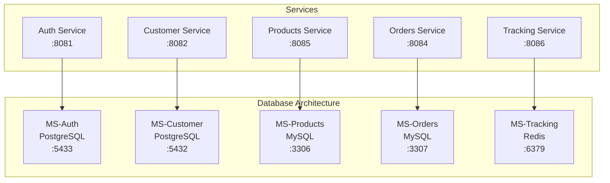
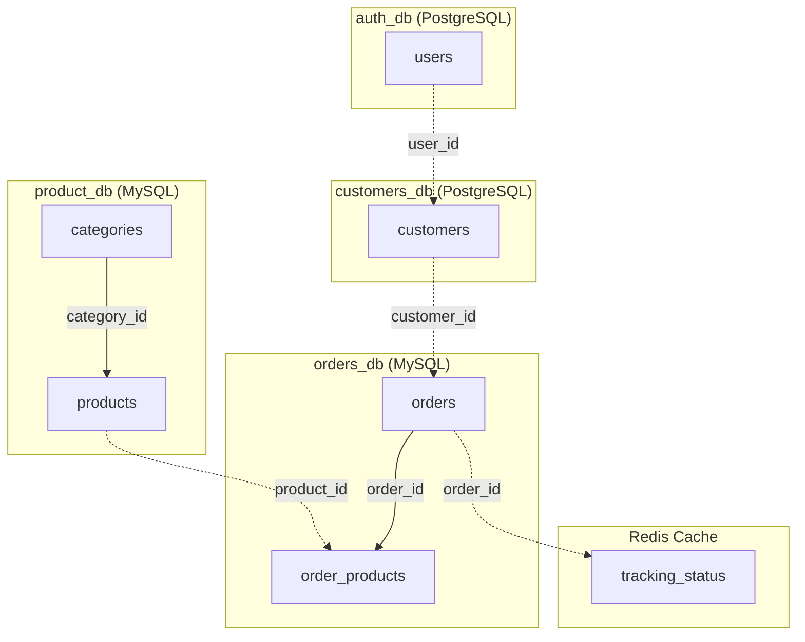

# 🗄️ Modelo Relacional - LuchoExpress E-commerce

## 📋 Índice

1. [Introducción](#introducción)
2. [Arquitectura de Datos](#arquitectura-de-datos)
3. [Diagrama Entidad-Relación (ER)](#diagrama-entidad-relación-er)
4. [Especificación de Bases de Datos](#especificación-de-bases-de-datos)
5. [Tablas por Microservicio](#tablas-por-microservicio)
6. [Relaciones Inter-Microservicios](#relaciones-inter-microservicios)
7. [Índices y Optimizaciones](#índices-y-optimizaciones)
8. [Scripts de Creación](#scripts-de-creación)
9. [Configuraciones de Conexión](#configuraciones-de-conexión)

---

## 📖 Introducción

Este documento presenta el **modelo relacional completo** del sistema LuchoExpress, que implementa una arquitectura de **microservicios distribuidos** con múltiples bases de datos especializadas. El sistema utiliza el patrón **Database per Service**, donde cada microservicio maneja su propia base de datos independiente.

## 🏗️ Arquitectura de Datos

### 🎯 Estrategia: Database per Service



### 🗂️ Bases de Datos por Tecnología

| Base de Datos | Tecnología | Puerto | Microservicio | Propósito |
|--------------|------------|---------|---------------|-----------|
| `auth_db` | PostgreSQL | 5433 | MS-Auth | Usuarios y autenticación |
| `customers_db` | PostgreSQL | 5432 | MS-Customer | Perfiles de clientes |
| `product_db` | MySQL | 3306 | MS-Products | Productos y categorías |
| `orders_db` | MySQL | 3307 | MS-Orders | Pedidos y detalles |
| Redis Cache | Redis | 6379 | MS-Tracking | Estado de seguimiento |

---

## 🔗 Diagrama Entidad-Relación (ER)

```mermaid
erDiagram
    %% ================================
    %% DATABASE: auth_db (PostgreSQL)
    %% ================================
    
    USERS {
        UUID id PK "Primary Key"
        VARCHAR(50) username UK "Unique, Not Null"
        TEXT password_hash "Not Null"
        VARCHAR(100) email UK "Unique, Not Null"
        VARCHAR(20) role "ENUM: ROOT, ADMIN, USER"
        BOOLEAN enabled "Default: true"
        TIMESTAMP created_at "Auto-generated"
    }
    
    %% ================================
    %% DATABASE: customers_db (PostgreSQL)
    %% ================================
    
    CUSTOMERS {
        UUID id PK "Primary Key"
        UUID user_id FK "Foreign Key to Users (logical)"
        VARCHAR(50) document_id UK "Unique, Not Null"
        VARCHAR(100) name "Not Null"
        VARCHAR(100) email UK "Unique, Not Null"
        VARCHAR(20) phone "Pattern validation"
        VARCHAR(255) address "Optional"
        BOOLEAN enabled "Default: true"
        TIMESTAMP created_at "Auto-generated"
        TIMESTAMP updated_at "Auto-updated"
    }
    
    %% ================================
    %% DATABASE: product_db (MySQL)
    %% ================================
    
    CATEGORIES {
        UUID id PK "Primary Key"
        VARCHAR(100) name "Not Null"
        VARCHAR(500) description "Optional"
        TIMESTAMP created_at "Auto-generated"
        TIMESTAMP updated_at "Auto-updated"
    }
    
    PRODUCTS {
        UUID id PK "Primary Key"
        UUID category_id FK "References Categories"
        VARCHAR(100) name "Not Null"
        VARCHAR(255) image_url "Optional"
        VARCHAR(500) description "Optional"
        DECIMAL(10,2) price "Not Null, Precision 10,2"
        TIMESTAMP created_at "Auto-generated"
        TIMESTAMP updated_at "Auto-updated"
    }
    
    %% ================================
    %% DATABASE: orders_db (MySQL)
    %% ================================
    
    ORDERS {
        UUID id PK "Primary Key"
        VARCHAR(255) order_number UK "Auto-generated, Unique"
        UUID customer_id "Logical FK to Customers"
        VARCHAR(255) delivery_address "Not Null"
        VARCHAR(20) status "ENUM: PENDING, SHIPPED, DELIVERED, CANCELLED"
        DATE order_date "Not Null, Auto-set"
        DATE estimated_delivery_date "Optional"
        DECIMAL(10,2) total_amount "Not Null, Calculated"
        TIMESTAMP created_at "Auto-generated"
        TIMESTAMP updated_at "Auto-updated"
    }
    
    ORDER_PRODUCTS {
        UUID id PK "Primary Key"
        UUID order_id FK "References Orders"
        UUID product_id "Logical FK to Products"
        INT quantity "Not Null, > 0"
        VARCHAR(255) product_name "Snapshot at order time"
        DECIMAL(10,2) unit_price "Snapshot at order time"
    }
    
    %% ================================
    %% REDIS: tracking data
    %% ================================
    
    TRACKING_STATUS {
        UUID order_id PK "Key in Redis"
        VARCHAR order_number "Cached data"
        UUID user_id "Cached data"
        VARCHAR status "Current order status"
        TIMESTAMP updated_at "Last update time"
    }
    
    %% ================================
    %% RELATIONSHIPS
    %% ================================
    
    %% Intra-database relationships
    CATEGORIES ||--o{ PRODUCTS : "has many"
    ORDERS ||--o{ ORDER_PRODUCTS : "contains"
    
    %% Logical cross-microservice relationships (no FK constraints)
    USERS ||--o| CUSTOMERS : "profile (logical)"
    CUSTOMERS ||--o{ ORDERS : "places (logical)"
    PRODUCTS ||--o{ ORDER_PRODUCTS : "referenced in (logical)"
    ORDERS ||--o| TRACKING_STATUS : "tracked in (logical)"
```

---


## 📚 Tablas por Microservicio

### 🔐 MS-Auth (auth_db - PostgreSQL)

#### 👥 USERS
```sql
CREATE TABLE users (
    id UUID PRIMARY KEY DEFAULT gen_random_uuid(),
    username VARCHAR(50) NOT NULL UNIQUE,
    password_hash TEXT NOT NULL,
    email VARCHAR(100) NOT NULL UNIQUE,
    role VARCHAR(20) NOT NULL DEFAULT 'USER',
    enabled BOOLEAN NOT NULL DEFAULT true,
    created_at TIMESTAMP NOT NULL DEFAULT CURRENT_TIMESTAMP,
    
    -- Índices para optimización
    CONSTRAINT idx_users_username UNIQUE (username),
    CONSTRAINT idx_users_email UNIQUE (email)
);

-- Índices adicionales
CREATE INDEX idx_users_role ON users(role);
CREATE INDEX idx_users_enabled ON users(enabled);
CREATE INDEX idx_users_created_at ON users(created_at);

-- Restricciones de rol
ALTER TABLE users ADD CONSTRAINT chk_users_role 
    CHECK (role IN ('ROOT', 'ADMIN', 'USER'));
```

**Campos Principales:**
- `id`: UUID generado automáticamente
- `username`: Identificador único del usuario (max 50 chars)
- `password_hash`: Hash BCrypt de la contraseña
- `email`: Email único del usuario (max 100 chars)
- `role`: Rol del sistema (ROOT, ADMIN, USER)
- `enabled`: Estado activo/inactivo del usuario

---

### 👤 MS-Customer (customers_db - PostgreSQL)

#### 🏢 CUSTOMERS
```sql
CREATE TABLE customers (
    id UUID PRIMARY KEY DEFAULT gen_random_uuid(),
    user_id UUID NOT NULL UNIQUE,  -- Logical FK to users.id
    document_id VARCHAR(50) NOT NULL UNIQUE,
    name VARCHAR(100) NOT NULL,
    email VARCHAR(100) NOT NULL UNIQUE,
    phone VARCHAR(20),
    address VARCHAR(255),
    enabled BOOLEAN NOT NULL DEFAULT true,
    created_at TIMESTAMP NOT NULL DEFAULT CURRENT_TIMESTAMP,
    updated_at TIMESTAMP NOT NULL DEFAULT CURRENT_TIMESTAMP,
    
    -- Índices para optimización
    CONSTRAINT idx_customers_user_id UNIQUE (user_id),
    CONSTRAINT idx_customers_document_id UNIQUE (document_id),
    CONSTRAINT idx_customers_email UNIQUE (email)
);

-- Índices adicionales
CREATE INDEX idx_customers_enabled ON customers(enabled);
CREATE INDEX idx_customers_created_at ON customers(created_at);

-- Validaciones
ALTER TABLE customers ADD CONSTRAINT chk_customers_phone 
    CHECK (phone ~ '^[+]?[0-9]{7,20}$');
```

**Campos Principales:**
- `id`: UUID generado automáticamente
- `user_id`: Referencia lógica al usuario de auth_db
- `document_id`: Documento de identidad único (cédula, etc.)
- `name`: Nombre completo del cliente
- `email`: Email del cliente (puede diferir del user email)
- `phone`: Teléfono con validación regex
- `address`: Dirección del cliente

---

### 🛍️ MS-Products (product_db - MySQL)

#### 📂 CATEGORIES
```sql
CREATE TABLE categories (
    id CHAR(36) PRIMARY KEY,
    name VARCHAR(100) NOT NULL,
    description VARCHAR(500),
    created_at TIMESTAMP NOT NULL DEFAULT CURRENT_TIMESTAMP,
    updated_at TIMESTAMP NOT NULL DEFAULT CURRENT_TIMESTAMP ON UPDATE CURRENT_TIMESTAMP,
    
    -- Índices
    INDEX idx_categories_name (name),
    INDEX idx_categories_created_at (created_at)
);

-- Restricción de nombre único
ALTER TABLE categories ADD CONSTRAINT uk_categories_name UNIQUE (name);
```

#### 🛒 PRODUCTS
```sql
CREATE TABLE products (
    id CHAR(36) PRIMARY KEY,
    category_id CHAR(36) NOT NULL,
    name VARCHAR(100) NOT NULL,
    image_url VARCHAR(255),
    description VARCHAR(500),
    price DECIMAL(10,2) NOT NULL,
    created_at TIMESTAMP NOT NULL DEFAULT CURRENT_TIMESTAMP,
    updated_at TIMESTAMP NOT NULL DEFAULT CURRENT_TIMESTAMP ON UPDATE CURRENT_TIMESTAMP,
    
    -- Foreign Keys
    FOREIGN KEY (category_id) REFERENCES categories(id) 
        ON DELETE RESTRICT ON UPDATE CASCADE,
    
    -- Índices
    INDEX idx_products_category_id (category_id),
    INDEX idx_products_name (name),
    INDEX idx_products_price (price),
    INDEX idx_products_created_at (created_at)
);

-- Validaciones
ALTER TABLE products ADD CONSTRAINT chk_products_price_positive 
    CHECK (price > 0);
```

**Relaciones:**
- `products.category_id` → `categories.id` (FK física)

---

### 📦 MS-Orders (orders_db - MySQL)

#### 🧾 ORDERS
```sql
CREATE TABLE orders (
    id CHAR(36) PRIMARY KEY,
    order_number VARCHAR(255) NOT NULL UNIQUE,
    customer_id CHAR(36) NOT NULL,  -- Logical FK to customers.id
    delivery_address VARCHAR(255) NOT NULL,
    status VARCHAR(20) NOT NULL DEFAULT 'PENDING',
    order_date DATE NOT NULL,
    estimated_delivery_date DATE,
    total_amount DECIMAL(10,2) NOT NULL DEFAULT 0.00,
    created_at TIMESTAMP NOT NULL DEFAULT CURRENT_TIMESTAMP,
    updated_at TIMESTAMP NOT NULL DEFAULT CURRENT_TIMESTAMP ON UPDATE CURRENT_TIMESTAMP,
    
    -- Índices
    INDEX idx_orders_customer_id (customer_id),
    INDEX idx_orders_status (status),
    INDEX idx_orders_order_date (order_date),
    INDEX idx_orders_order_number (order_number),
    INDEX idx_orders_created_at (created_at)
);

-- Restricciones
ALTER TABLE orders ADD CONSTRAINT chk_orders_status 
    CHECK (status IN ('PENDING', 'SHIPPED', 'DELIVERED', 'CANCELLED'));
ALTER TABLE orders ADD CONSTRAINT chk_orders_total_positive 
    CHECK (total_amount >= 0);
```

#### 🛍️ ORDER_PRODUCTS
```sql
CREATE TABLE order_products (
    id CHAR(36) PRIMARY KEY,
    order_id CHAR(36) NOT NULL,
    product_id CHAR(36) NOT NULL,  -- Logical FK to products.id
    quantity INT NOT NULL,
    product_name VARCHAR(255) NOT NULL,  -- Snapshot
    unit_price DECIMAL(10,2) NOT NULL,   -- Snapshot
    
    -- Foreign Keys
    FOREIGN KEY (order_id) REFERENCES orders(id) 
        ON DELETE CASCADE ON UPDATE CASCADE,
    
    -- Índices
    INDEX idx_order_products_order_id (order_id),
    INDEX idx_order_products_product_id (product_id)
);

-- Validaciones
ALTER TABLE order_products ADD CONSTRAINT chk_order_products_quantity_positive 
    CHECK (quantity > 0);
ALTER TABLE order_products ADD CONSTRAINT chk_order_products_unit_price_positive 
    CHECK (unit_price > 0);
```

**Relaciones:**
- `order_products.order_id` → `orders.id` (FK física)
- `orders.customer_id` → `customers.id` (FK lógica)
- `order_products.product_id` → `products.id` (FK lógica)

---

### 📍 MS-Tracking (Redis Cache)

#### 🔍 TRACKING_STATUS (Estructura en Redis)
```json
{
  "key": "tracking:order:{order_id}",
  "value": {
    "orderId": "uuid",
    "orderNumber": "ORD-XXXXXXXX", 
    "userId": "uuid",
    "status": "PENDING|SHIPPED|DELIVERED|CANCELLED",
    "updatedAt": "2024-12-10T15:30:00Z"
  },
  "ttl": 86400
}
```

**Patrones de Clave:**
- `tracking:order:{order_id}` - Estado individual del pedido
- `tracking:user:{user_id}` - Lista de pedidos del usuario
- `tracking:status:{status}` - Pedidos por estado

---

## 🔗 Relaciones Inter-Microservicios

### 🎯 Relaciones Lógicas (Sin FK Físicas)



### 📊 Matriz de Dependencias

| Desde/Hacia | Users | Customers | Categories | Products | Orders | OrderProducts | Tracking |
|-------------|--------|-----------|------------|----------|---------|---------------|----------|
| **Users** | - | Lógica | - | - | - | - | - |
| **Customers** | - | - | - | - | Lógica | - | - |
| **Categories** | - | - | - | Física | - | - | - |
| **Products** | - | - | - | - | - | Lógica | - |
| **Orders** | - | - | - | - | - | Física | Lógica |
| **OrderProducts** | - | - | - | - | - | - | - |
| **Tracking** | - | - | - | - | - | - | - |

**Leyenda:**
- **Física**: Foreign Key constraint en base de datos
- **Lógica**: Referencia por UUID sin constraint (cross-microservice)

---

